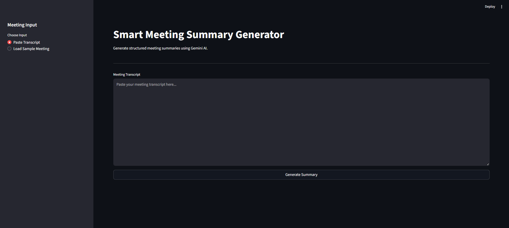
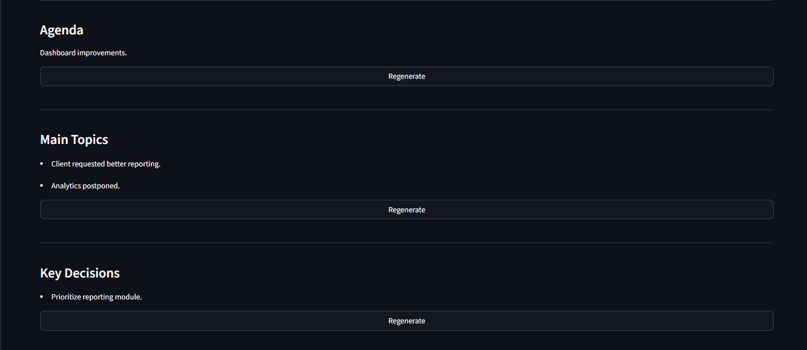
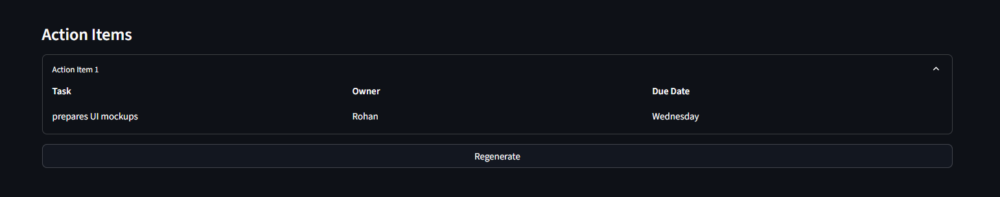
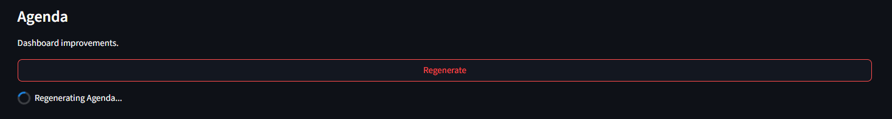
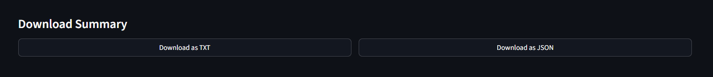
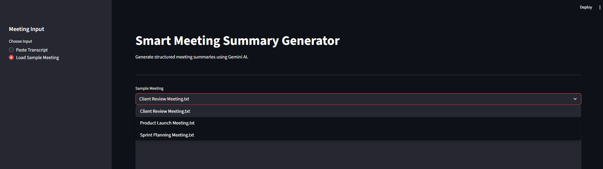

# 📝 Smart Meeting Summary Generator

An AI-powered meeting summarization application that transforms unstructured meeting transcripts into structured summaries using **Google Gemini AI** and **Retrieval-Augmented Generation (RAG)**.

The application extracts meeting agenda, discussion topics, key decisions, and action items while allowing users to regenerate individual sections without recreating the entire summary.

---

## 📸 Application Preview

### Home Page



### Generated Summary



### Action Items



### Regeneration Feature



### Download Options



### Sample Meetings



---

# ✨ Features

- Generate structured meeting summaries from raw transcripts
- Retrieval-Augmented Generation (RAG) using previous meeting context
- AI-powered summarization using Google Gemini
- Extracts:
  - Agenda
  - Main Topics
  - Key Decisions
  - Action Items
- Regenerate individual sections independently
- Download summaries as:
  - TXT
  - JSON
- Built-in sample meetings for quick testing
- Automatic summary validation
- Clean and responsive Streamlit interface

---

# 🏗️ Project Architecture

```
                Meeting Transcript
                        │
                        ▼
               RAG Context Retrieval
                        │
                        ▼
                 Google Gemini AI
                        │
                        ▼
              Summary Validation
                        │
                        ▼
         Structured Meeting Summary
                        │
                        ▼
      Individual Section Regeneration
                        │
                        ▼
          TXT / JSON Export
```

---

# 🛠️ Tech Stack

| Technology | Purpose |
|------------|---------|
| Python | Backend |
| Streamlit | User Interface |
| Google Gemini | Large Language Model |
| ChromaDB | Vector Database |
| Sentence Transformers | Embedding Generation |
| LangChain | RAG Pipeline |
| JSON | Structured Output |

---

# 📂 Project Structure

```text
Smart-Meeting-Summary-Generator/
│
├── assets/
│   └── screenshots/
│
├── data/
│   └── .gitkeep
│
├── sample_data/
│
├── services/
│   ├── __init__.py
│   ├── llm_service.py
│   ├── rag_service.py
│   ├── regenerate.py
│   ├── summarizer.py
│   └── validator.py
│
├── .env.example
├── .gitignore
├── app.py
├── config.py
├── prompts.py
├── requirements.txt
└── README.md
```

---

# ⚙️ Installation

Clone the repository

```bash
git clone https://github.com/nakul85/smart-meeting-summary-generator.git
```

Move into the project

```bash
cd smart-meeting-summary-generator
```

Create a virtual environment

```bash
python -m venv venv
```

Activate the virtual environment

**Windows**

```bash
venv\Scripts\activate
```

**Linux / macOS**

```bash
source venv/bin/activate
```

Install dependencies

```bash
pip install -r requirements.txt
```

---

# 🔑 Environment Variables

Create a `.env` file in the project root.

```env
GEMINI_API_KEY=your_google_gemini_api_key
MODEL_NAME=gemini-2.5-flash
```

---

# ▶️ Run the Application

```bash
streamlit run app.py
```

The application will be available at

```
http://localhost:8501
```

---

# 🚀 Usage

1. Paste a meeting transcript or select a sample meeting.
2. Click **Generate Summary**.
3. Review the generated:
   - Agenda
   - Main Topics
   - Key Decisions
   - Action Items
4. Regenerate any individual section if required.
5. Download the final summary in TXT or JSON format.

---

# 🧠 How It Works

1. The transcript is processed.
2. Similar meetings are retrieved using ChromaDB.
3. Retrieved context is combined with the current transcript.
4. Google Gemini generates a structured JSON summary.
5. The output is validated.
6. Individual sections can be regenerated independently.
7. Users can export the summary as TXT or JSON.

---

# 🔮 Future Improvements

- PDF and DOCX transcript upload
- Speaker identification
- Meeting sentiment analysis
- Calendar integration
- Email summary sharing
- Multi-language support
- Authentication and user accounts
- Cloud deployment

